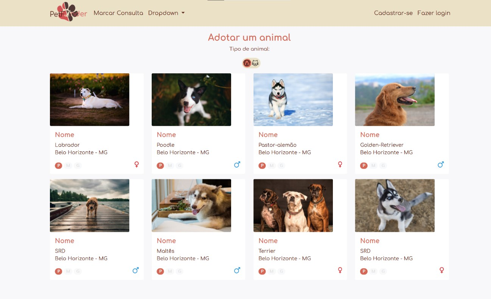
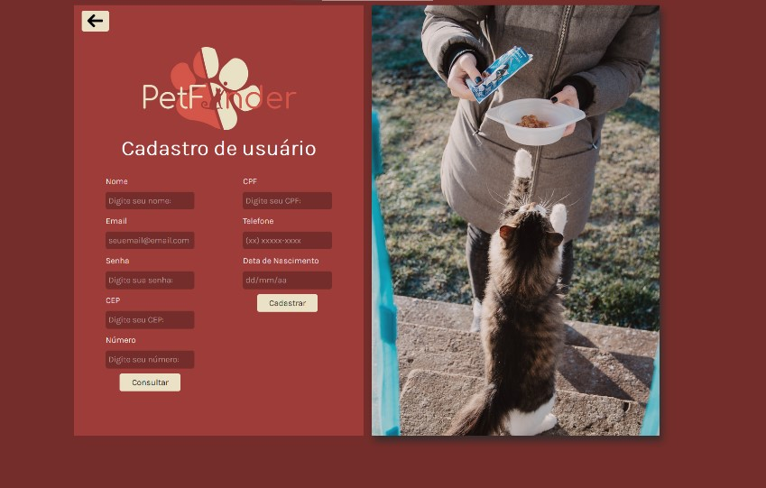
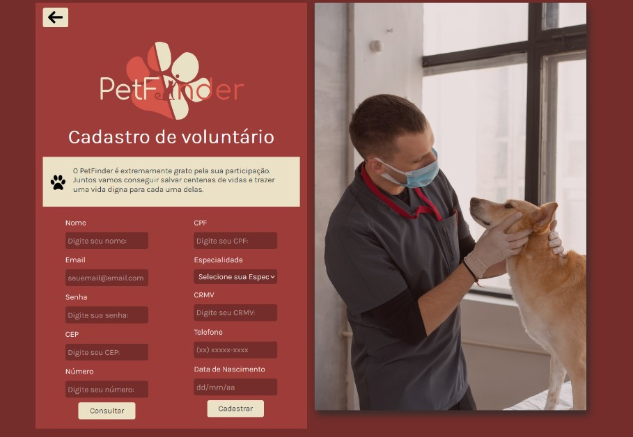
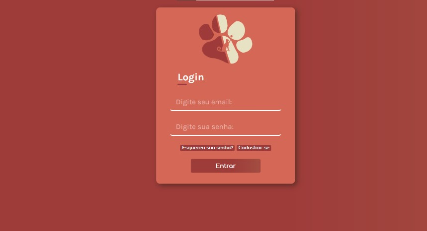

# PetFinder

Projeto realizado na disciplina de Trabalho Interdisciplinar: Aplicações para Processos de Negócios. 

## Resumo
Consiste em um sistema que auxiliará na adoção ou doação de animais em condições de rua. O usuário é capaz de cadastrar cachorros e gatos encontrados na rua ou consultar uma lista de animais disponíveis para serem adotados e terem um lar. 

## Tecnologias

Para a implementação do projeto, foram utilizadas as seguintes tecnologias:

#### HTML5, CSS3, PHP e JavaScript
#### JQuery
#### APIs (Correios - Informações do CEP | Placedog e Placekitten - Api que simula as fotos dos animais)
#### Bootstrap 4

## Imagens do Sistema

### Tela Inicial
Tela inicial do sistema. É por ela que o usuário navega no site e acessa as demais telas.
Dentro da tela inicial, caso o usuário deseje visualizar somente um tipo de animal, basta usar os botões indicadores.

### Cadastro
Tela responsável por fazer o cadastramento do usuário.

Caso o usuário seja uma pessoa comum:

Caso o usuário seja um voluntário:

### Login
Tela do Login. É por ela que o usuário se conecta na sua conta cadastrada.

